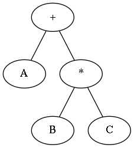
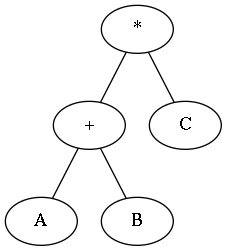

class: center, bottom, inverse

# HERE BE DRAGONS

## charting parse transforms in Erlang
---
## Our journey
.left-column[
  ### What is a parse transform?
]

.right-column[
  ## Erlang Manual:

  .boxed[
    Programmers are strongly advised not to engage in parse transforms
    and no support is offered for problems encountered.
  ]
]
---
## Our journey
.left-column[
  ### What is a parse transform?
  ### Program as data
]

.right-column[
  ## The Abstract Format
]
---
## Our journey
.left-column[
  ### What is a parse transform?
  ### Program as data
  ### Working with Abstract Format
]

.right-column[
  ## Bring your sword to the dragon fight
]
---
.left-column[
  ## Our journey
  ### What is a parse transform?
  ### Program as data
  ### Working with Abstract Format
  ### Parse transforms in the wild
]

.right-column[
  ## Other monsters in the menagerie
]
---
.left-column[
  ## Our journey
  ### What is a parse transform?
  ### Program as data
  ### Working with Abstract Format
  ### Parse transforms in the wild
  ### Inline parse transform
]

.right-column[
  ## Have the dragon eat it's own tail
]
---
class: middle, center, inverse
# What is a parse transform?
---
class: middle

.pull-left[
Source

&darr;

Compiler

&darr;

Executable

]

.pull-right[
`module.erl`

&darr;

```sh
> erlc module.erl
```

&darr;

`module.beam`
]

---
# Classic compilation steps
.pull-left[
1. Expand macros
2. Lex
3. Parse
4. Abstract syntax tree
5. Optimize
6. Generate bytecode
]
.pull-right[

]

---
# Classic compilation steps
1. Expand macros
2. Lex
3. Parse
4. Abstract syntax tree
5. .highlighted[&rarr;] &nbsp; Transformed syntax tree = `your_function(AST)` &nbsp; .highlighted[&larr;]
6. Optimize
7. Generate bytecode

---
# Identity transform

```erlang
-module(my_transform).

-export([parse_transform/2]).

parse_transform(Forms, Options) ->
  Forms.
```

---
# Invoke a parse transform
erlc
```sh
erlc my_transform.erl
erlc -pa . +"{parse_transform,my_transform}" test.erl
```

rebar.config
```erlang
{erl_opts, [
            {parse_transform, my_transform}
           ]}.
```

module inline
```erlang
-module(test).

-compile([{parse_transform, my_transform}]).

...
```
---
class: center, middle, inverse

# Abstract Format
## Your program as data
---
# Abstract Syntax Tree

.pull-left[
### A + B * C

]
--
.pull-right[
### (A + B) * C

]
---
# Abstract Syntax Tree

.pull-left[
### A + B * C

```erlang
{'+',
  A,
  {'*', B, C}}
```
]
.pull-right[
### (A + B) * C

```erlang
{'*',
  {'+', A, B},
  C}
```
]
---
```erlang
-module(test).

-compile([{parse_transform, my_transform}]).

-export([hello/1]).

hello(Who) ->
    io:fwrite("hello ~p", [Who]).
```

```erlang
[{attribute,1,file,{"test.erl",1}},
 {attribute,1,module,test},
 {attribute,3,compile,[]},
 {attribute,5,export,[{hello,1}]},
 {function,7,hello,1,
           [{clause,7,
                    [{var,7,'Who'}],
                    [],
                    [{call,8,
                           {remote,8,{atom,8,io},{atom,8,fwrite}},
                           [{string,8,"hello ~p"},
                            {cons,8,{var,8,'Who'},{nil,8}}]}]}]},
 {eof,10}]
```
---
```erlang
*-module(test).

-compile([{parse_transform, my_transform}]).

-export([hello/1]).

hello(Who) ->
    io:fwrite("hello ~p", [Who]).
```

```erlang
[{attribute,1,file,{"test.erl",1}},
* {attribute,1,module,test},
 {attribute,3,compile,[]},
 {attribute,5,export,[{hello,1}]},
 {function,7,hello,1,
           [{clause,7,
                    [{var,7,'Who'}],
                    [],
                    [{call,8,
                           {remote,8,{atom,8,io},{atom,8,fwrite}},
                           [{string,8,"hello ~p"},
                            {cons,8,{var,8,'Who'},{nil,8}}]}]}]},
 {eof,10}]
```
---
```erlang
-module(test).

*-compile([{parse_transform, my_transform}]).

-export([hello/1]).

hello(Who) ->
    io:fwrite("hello ~p", [Who]).
```

```erlang
[{attribute,1,file,{"test.erl",1}},
 {attribute,1,module,test},
* {attribute,3,compile,[]},
 {attribute,5,export,[{hello,1}]},
 {function,7,hello,1,
           [{clause,7,
                    [{var,7,'Who'}],
                    [],
                    [{call,8,
                           {remote,8,{atom,8,io},{atom,8,fwrite}},
                           [{string,8,"hello ~p"},
                            {cons,8,{var,8,'Who'},{nil,8}}]}]}]},
 {eof,10}]
```
---
```erlang
-module(test).

-compile([{parse_transform, my_transform}]).

*-export([hello/1]).

hello(Who) ->
    io:fwrite("hello ~p", [Who]).
```

```erlang
[{attribute,1,file,{"test.erl",1}},
 {attribute,1,module,test},
 {attribute,3,compile,[]},
* {attribute,5,export,[{hello,1}]},
 {function,7,hello,1,
           [{clause,7,
                    [{var,7,'Who'}],
                    [],
                    [{call,8,
                           {remote,8,{atom,8,io},{atom,8,fwrite}},
                           [{string,8,"hello ~p"},
                            {cons,8,{var,8,'Who'},{nil,8}}]}]}]},
 {eof,10}]
```
---
```erlang
-module(test).

-compile([{parse_transform, my_transform}]).

-export([hello/1]).

*hello(Who) ->
    io:fwrite("hello ~p", [Who]).
```

```erlang
[{attribute,1,file,{"test.erl",1}},
 {attribute,1,module,test},
 {attribute,3,compile,[]},
 {attribute,5,export,[{hello,1}]},
* {function,7,hello,1,
*           [{clause,7,
*                    [{var,7,'Who'}],
*                    [],
                    [{call,8,
                           {remote,8,{atom,8,io},{atom,8,fwrite}},
                           [{string,8,"hello ~p"},
                            {cons,8,{var,8,'Who'},{nil,8}}]}]}]},
 {eof,10}]
```
---
```erlang
-module(test).

-compile([{parse_transform, my_transform}]).

-export([hello/1]).

* `hello`(`Who`) ->
    io:fwrite("hello ~p", [Who]).
```

```erlang
[{attribute,1,file,{"test.erl",1}},
 {attribute,1,module,test},
 {attribute,3,compile,[]},
 {attribute,5,export,[{hello,1}]},
* {function,7,`hello`,1,
*           [{clause,7,
*                    [{var,7,'`Who`'}],
*                    [],
                    [{call,8,
                           {remote,8,{atom,8,io},{atom,8,fwrite}},
                           [{string,8,"hello ~p"},
                            {cons,8,{var,8,'Who'},{nil,8}}]}]}]},
 {eof,10}]
```
---
```erlang
-module(test).

-compile([{parse_transform, my_transform}]).

-export([hello/1]).

*hello(Who)` `->
    io:fwrite("hello ~p", [Who]).
```

```erlang
[{attribute,1,file,{"test.erl",1}},
 {attribute,1,module,test},
 {attribute,3,compile,[]},
 {attribute,5,export,[{hello,1}]},
 {function,7,hello,1,
           [{clause,7,
                    [{var,7,'Who'}],
*                   `[]`,
                    [{call,8,
                           {remote,8,{atom,8,io},{atom,8,fwrite}},
                           [{string,8,"hello ~p"},
                            {cons,8,{var,8,'Who'},{nil,8}}]}]}]},
 {eof,10}]
```
---
```erlang
-module(test).

-compile([{parse_transform, my_transform}]).

-export([hello/1]).

hello(Who) ->
*   io:fwrite("hello ~p", [Who]).
```

```erlang
[{attribute,1,file,{"test.erl",1}},
 {attribute,1,module,test},
 {attribute,3,compile,[]},
 {attribute,5,export,[{hello,1}]},
 {function,7,hello,1,
           [{clause,7,
                    [{var,7,'Who'}],
                    [],
*                   [{call,8,
*                          {remote,8,{atom,8,io},{atom,8,fwrite}},
*                          [{string,8,"hello ~p"},
*                           {cons,8,{var,8,'Who'},{nil,8}}]}]}]},
 {eof,10}]
```
---
```erlang
-module(test).

-compile([{parse_transform, my_transform}]).

-export([hello/1]).

hello(Who) ->
*   `io`:`fwrite`("hello ~p", [Who]).
```

```erlang
[{attribute,1,file,{"test.erl",1}},
 {attribute,1,module,test},
 {attribute,3,compile,[]},
 {attribute,5,export,[{hello,1}]},
 {function,7,hello,1,
           [{clause,7,
                    [{var,7,'Who'}],
                    [],
*                   [{call,8,
*                          {remote,8,{atom,8,`io`},{atom,8,`fwrite`}},
*                          [{string,8,"hello ~p"},
*                           {cons,8,{var,8,'Who'},{nil,8}}]}]}]},
 {eof,10}]
```
---
```erlang
-module(test).

-compile([{parse_transform, my_transform}]).

-export([hello/1]).

hello(Who) ->
    io:fwrite(`"hello ~p", [Who]`).
```

```erlang
[{attribute,1,file,{"test.erl",1}},
 {attribute,1,module,test},
 {attribute,3,compile,[]},
 {attribute,5,export,[{hello,1}]},
 {function,7,hello,1,
           [{clause,7,
                    [{var,7,'Who'}],
                    [],
                    [{call,8,
                           {remote,8,{atom,8,io},{atom,8,fwrite}},
                           `[{string,8,"hello ~p"},`
                            `{cons,8,{var,8,'Who'},{nil,8}}]`}]}]},
 {eof,10}]
```
---
class: middle, center, inverse
# Setting Sail
## Transform some parse trees!
---
# Hypothetical application

Whenever the ETS table `contentious_table` is accessed, fire off a message to a
tracker process with the ETS method used: select / insert / update / delete.

The tracker process could then accumulate number of calls / time.  You could
begin to get an idea of what processes are using this table and how often.

--
## Problem

- Find: `ets:insert(contentious_table, Objects)`

--

- Insert: `ets_collector ! {insert, self()}`

--

- Bonus: `ets_collector ! {insert, length(Objects), self()}`

---
### What does that look like in AF???

```erlang
1> {ok, Tokens, _} =
       erl_scan:string("ets:insert(contentious_table, Objects).").

2> {ok, Forms} = erl_parse:parse_exprs(Tokens).

3> Forms.
[{call,1,
       {remote,1,{atom,1,ets},{atom,1,insert}},
       [{atom,1,contentious_table},{var,1,'Objects'}]}]
```

--
OK, match on
```erlang
{call, _,
 {remote, _, {atom, _, `ets`}, {atom, _, `insert`}},
 [{atom, _, `contentious_table`}, {var, _, `'Objects'`}]}
```

???
Just make sure not to match on `Objects` since the variable name might be
different.

---
### ... and insert ...

```erlang
1> {ok, Tokens, _} =
       erl_scan:string("ets_collector ! {insert, self()}.").

2> {ok, Forms} = erl_parse:parse_exprs(Tokens).

3> Forms.
[{op,1,'!',
     {atom,1,ets_collector},
     {tuple,1,[{atom,1,insert},{call,1,{atom,1,self},[]}]}}]
```
---
# Transform function!
```erlang
transform_ets_insert({call, Line,
                       {remote, _, {atom, _, ets},
                         {atom, _, insert}},
                       [{atom, _, contentious_table},
                         Objects]}
                     = Form) ->
    {op,Line,'!',
      {atom,Line,ets_collector},
      {tuple,Line,[{atom,Line,insert},
                   {call,Line,{atom,Line,self},[]}]}};
transform_ets_insert(Form) ->
    Form.

```
--
... well, almost ...
---
### Turn this
```erlang
ets:insert(contentious_table, Objects),
```
--
### Into this
```erlang
ets_collector ! {insert, self()},
ets:insert(contentious_table, Objects),
```
### without changing the _shape_ of the parse tree.
### replace a single node with a different single node (not a list)
---
### What about this?
```erlang
begin
    ets_collector ! {insert, self()},
    ets:insert(contentious_table, Objects)
end,
```
--
.checklist[
- Single AST node
]
--
.checklist[
- Same expression value
]
---
### Complete AST node transform 
```erlang
transform_ets_insert({call, Line,
                       {remote, _, {atom, _, ets},
                         {atom, _, insert}},
                       [{atom, _, contentious_table}, Objects]}
                     = Form) ->
    {block, Line, [{op,Line,'!',
                    {atom,Line,ets_collector},
                    {tuple,Line,[{atom,Line,insert},
                                {call,Line,{atom,Line,self},[]}]}},
                   Form]};
transform_ets_insert(Form) ->
    Form.
```
--
### Now to use it!
---
# Transform this
```erlang
change_username(UserId, UserName) when UserId =:= 0 ->
  error("Can't change admin user name");
change_username(UserId, UserName) ->
  Users = ets:lookup(contentious_table, UserId),
  [User] = Users,
  case User#user.group of
    luser ->
      error("Insufficient privileges");
    G when G =:= user; G =:= admin ->
      ets:insert(contentious_table, User#user{name = UserName})
  end.
```
---
.smaller[
```erlang
{function,25,change_username,2,
    [{clause,25,
        [{var,25,'UserId'},{var,25,'UserName'}],
        [[{op,25,'=:=',{var,25,'UserId'},{integer,25,0}}]],
        [{call,26,
              {atom,26,error},
              [{string,26,"Can't change admin user name"}]}]},
    {clause,27,
        [{var,27,'UserId'},{var,27,'UserName'}],
        [],
        [{match,28,
              {var,28,'Users'},
              {call,28,
                  {remote,28,{atom,28,ets},{atom,28,lookup}},
                  [{atom,28,contentious_table},{var,28,'UserId'}]}},
          {match,29,{cons,29,{var,29,'User'},{nil,29}},{var,29,'Users'}},
          {case,30,
              {record_field,30,{var,30,'User'},user,{atom,30,group}},
              [{clause,31,
                  [{atom,31,luser}],
                  [],
                  [{call,32,
                        {atom,32,error},
                        [{string,32,"Insufficient privileges"}]}]},
              {clause,33,
                  [{var,33,'G'}],
                  [[{op,33,'=:=',{var,33,'G'},{atom,33,user}}],
                    [{op,33,'=:=',{var,33,'G'},{atom,33,admin}}]],
                  [{call,34,
                        {remote,34,{atom,34,`ets`},{atom,34,`insert`}},
                        [{atom,34,`contentious_table`},
                        {record,34,
                            {var,34,'User'},
                            user,
                            [{record_field,34,
                                  {atom,34,name},
                                  {var,34,'UserName'}}]}]}]}]}]}]}
```
]
---
class: middle, center, inverse
# Lets take a step back

# &nbsp;


---
class: middle, center, inverse
# Working with Abstract Format
## Bring your sword to the dragon fight

---
# Isn't there something to help?

## `stdlib`
- epp - Erlang preprocessor (macros and includes)
- erl_scan - Turn text into tokens
- erl_parse - Turn tokens into an AST
- erl_pp - Turn an AST back into text (Pretty Print it)
- erl_eval - Execute ASTs
- erl_id_trans - Identity transform that walks the whole AST

--

## `syntax_tools`
- erl_prettypr - Another pretty-printer of ASTs
- erl_syntax - Define a 'super-set' of the `stdlib` AST
- erl_syntax_lib - Helper functions for working with ASTs
---
# Common pattern

1. Find an AST node of interest, e.g., a function call

2. Extract context / detail

3. Create a modified node

4. Replace the node with the modified one

5. Do this for all nodes

6. Hand the new AST back to the compiler
---
## erl_syntax_lib
```erlang
map(Fun, AST) -> AST1.

map_fun(AstNode) -> AstNode1.
```
--
```erlang
fold(Fun, Acc, AST) -> Acc1.

fold_fun(AstNode, Acc) -> Acc1.
```
--
```erlang
mapfold(Fun, Acc, AST) -> {AST1, Acc1}.

mapfold_fun(Node, Acc) -> {Node1, Acc1}.
```
---
## Complete parse transform
.small[
```erlang
parse_transform(Forms, _Options) ->
    Forms1 = [erl_syntax_lib:map(
                fun(Node) ->
                    transform_ets_insert(
                      erl_syntax:revert(Node))
                end,
                F)
              || F <- Forms],
    erl_syntax:revert_forms(Forms1).

transform_ets_insert({call, Line,
                       {remote, _, {atom, _, ets},
                         {atom, _, insert}},
                       [{atom, _, contentious_table}, _Objects]}
                     = Form) ->
    {block, Line, [{op,Line,'!',
                    {atom,Line,ets_collector},
                    {tuple,Line,[{atom,Line,insert},
                                {call,Line,{atom,Line,self},[]}]}},
                   Form]};
transform_ets_insert(Form) ->
    Form.
```
]
---
### A module is a list of trees (not a tree of trees)
.small[
```erlang
parse_transform(Forms, _Options) ->
    Forms1 = [erl_syntax_lib:map(
                fun(Node) ->
                    transform_ets_insert(
                      erl_syntax:revert(Node))
                end,
                F)
              || `F <- Forms`],
    erl_syntax:revert_forms(Forms1).

transform_ets_insert({call, Line,
                       {remote, _, {atom, _, ets},
                         {atom, _, insert}},
                       [{atom, _, contentious_table}, _Objects]}
                     = Form) ->
    {block, Line, [{op,Line,'!',
                    {atom,Line,ets_collector},
                    {tuple,Line,[{atom,Line,insert},
                                {call,Line,{atom,Line,self},[]}]}},
                   Form]};
transform_ets_insert(Form) ->
    Form.
```
]
---
### `erl_syntax_lib` has a different AST
.small[
```erlang
parse_transform(Forms, _Options) ->
    Forms1 = [erl_syntax_lib:map(
                fun(Node) ->
                    transform_ets_insert(
                      `erl_syntax:revert(Node)`)
                end,
                F)
              || F <- Forms],
    `erl_syntax:revert_forms(Forms1)`.

transform_ets_insert({call, Line,
                       {remote, _, {atom, _, ets},
                         {atom, _, insert}},
                       [{atom, _, contentious_table}, _Objects]}
                     = Form) ->
    {block, Line, [{op,Line,'!',
                    {atom,Line,ets_collector},
                    {tuple,Line,[{atom,Line,insert},
                                {call,Line,{atom,Line,self},[]}]}},
                   Form]};
transform_ets_insert(Form) ->
    Form.
```
]
---
class: middle, center, inverse
# Why _not_ parse transforms?
---
# Why _not_ parse transforms?

- Quite complex - requires a deep understanding of the Erlang grammar

--

- Abstract Format can change as the language evolves

--

- Your bug just became a compiler bug

--

- Slows down compilation

--

- Code becomes difficult or impossible to reason about
---
class: center, middle, inverse
# Parse transforms in the wild
---
## Another Erlang to Object Notation translator*

(aeon) [https://github.com/garret-smith/aeon](https://github.com/garret-smith/aeon)

.smaller[
```erlang
-record(user, {
          name :: binary(),
          height :: float(),
          birthday :: {Year :: integer(),
                       Month :: integer(),
                       Day :: integer()},
          privileges :: [privilege()]
         }).
```
```erlang
User = #user{
          name = <<"Garret Smith">>,
          height = 6.0,
          birthday = {1982, 06, 29},
          privileges = [login, create, delete, grant]
         },
Json = jsx:encode(aeon:record_to_jsx(User, ?MODULE)),
User1 = aeon:to_record(jsx:decode(Json), ?MODULE, user),
*User = User1
```
```json
{
  "name":"Garret Smith",
  "height":6.0,
  "birthday":[1982,6,29],
  "privileges":["login","create","delete","grant"]
}
```
]

.footnote[*I wrote it]
---
## aeon Parse Transform
```erlang
-include_lib("parse_trans/include/codegen.hrl").

parse_transform(Forms, Options) ->
	parse_trans:top(fun do_transform/2, Forms, Options).

do_transform(Forms, Context) ->
	F = erl_syntax_lib:analyze_forms(Forms),
	case lists:keyfind(attributes, 1, F) of
		false -> Forms;
		{K, R} ->
			Attr = lists:flatten([transform_attribute(A) || A<-R]),
			Func = `codegen:gen_function`(
						?FUN_NAME, fun() -> {'$var', Attr} end),
			Forms2 = `parse_trans:do_insert_forms`(below, [Func],
												  Forms, Context),
			Forms3 = `parse_trans:export_function`(?FUN_NAME,
												  0, Forms2),
			parse_trans:revert(Forms3)
	end.
```
---
# parse_trans

[https://github.com/uwiger/parse_trans.git](https://github.com/uwiger/parse_trans.git)

- Convenience functions for common cases.

- Error handling for your transform (you will want this)

- codegen: A parse transform for your parse transform.

- Create new functions or entire modules from thin air.

--

- exprecs, generate and export accessor functions for record fields.
---
## lager (as in beer)

[https://github.com/basho/lager.git](https://github.com/basho/lager.git)

Turn the log statement `lager:info("~s", ["hello"])` into:
.small[
```erlang
case {whereis(lager_event), whereis(lager_event),
      lager_config:get({lager_event, loglevel}, {0, []})}
    of
  {undefined, undefined, _} ->
      fun () -> {error, lager_not_running} end();
  {undefined, _, _} ->
      fun () -> {error, {sink_not_configured, lager_event}}
      end();
  {__Pidlager_test6, _,
   {__Levellager_test6, __Traceslager_test6}}
      when __Levellager_test6 band 64 /= 0 orelse
             __Traceslager_test6 /= [] ->
      lager:do_log(info,
                   [{module, lager_test}, {function, say_hello}, {line, 6},
                    {pid, pid_to_list(self())}, {node, node()}
                    | lager:md()],
                   "~s", ["hello"], 4096, 64, __Levellager_test6,
                   __Traceslager_test6, lager_event, __Pidlager_test6);
  _ -> ok
end
```
]
---
## PARE - PARallel Execution in Erlang

[http://chlorophil.blogspot.com/2007/11/pare-parallel-execution-in-erlang.html](http://chlorophil.blogspot.com/2007/11/pare-parallel-execution-in-erlang.html)

Basic idea: embed atoms to automatically parallelize execution of sequential code.

```erlang
parallel_next_3,
A = a(),
b(),
c(),
```
---
## seqbind

[https://github.com/spawngrid/seqbind](https://github.com/spawngrid/seqbind)

```erlang
V1 = foo(V),
V2 = bar(V1),
V3 = baz(V2)
```

```erlang
V@ = foo(V),
V@ = bar(V@),
V@ = baz(V@)
```
---
# Zen of parse transforms

--

- _raw speed_, where the time invested in optimization pays off because of widespread reuse (lager).

--

- Repetitive code generation, e.g. record access functions (exprecs).

--

- Make use of information lost during compilation, like types (aeon).

--

- Extend Erlang with new, custom semanics (seqbind).

--

- Experimentation with new language semantics.  Easier than writing a compiler (PARE).
---
class: center, middle, inverse
# Thanks
