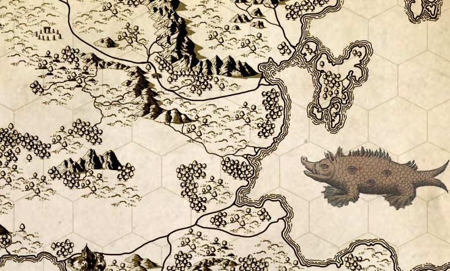

class: center, bottom, inverse

# HERE BE DRAGONS

## charting parse transforms in Erlang
---
## Our journey
.left-column[
  ### What is a parse transform?
]

.right-column[
  ## Erlang Manual:

  .boxed[
    Programmers are strongly advised not to engage in parse transforms
    and no support is offered for problems encountered.
  ]
]
---
## Our journey
.left-column[
  ### What is a parse transform?
  ### Program as data
]

.right-column[
  ## The Abstract Format
]
---
## Our journey
.left-column[
  ### What is a parse transform?
  ### Program as data
  ### Working with Abstract Format
]

.right-column[
  ## Bring your sword to the dragon fight
]
---
.left-column[
  ## Our journey
  ### What is a parse transform?
  ### Program as data
  ### Working with Abstract Format
  ### Parse transforms in the wild
]

.right-column[
  ## Other monsters in the menagerie
]
---
.left-column[
  ## Our journey
  ### What is a parse transform?
  ### Program as data
  ### Working with Abstract Format
  ### Parse transforms in the wild
  ### Inline parse transform
]

.right-column[
  ## Have the dragon eat it's own tail
]
---
class: middle, center, inverse
# What is a parse transform?
---
class: middle

.float-left[
Source

&darr;

Compiler

&darr;

Executable

]

.float-right[
`module.erl`

&darr;

```sh
> erlc module.erl
```

&darr;

`module.beam`
]

---
# Classic compilation steps
.float-left[
1. Expand macros
2. Lex
3. Parse
4. Abstract syntax tree
5. Optimize
6. Generate bytecode
]
.float-right[

]

---
# Classic compilation steps
1. Expand macros
2. Lex
3. Parse
4. Abstract syntax tree
5. .highlighted[&rarr;] &nbsp; Transformed syntax tree = `your_function(AST)` &nbsp; .highlighted[&larr;]
6. Optimize
7. Generate bytecode

---
# Identity transform

```erlang
-module(my_transform).

-export([parse_transform/2]).

parse_transform(Forms, Options) ->
  Forms.
```

---
# Invoke a parse transform
erlc
```sh
erlc my_transform.erl
erlc -pa . +"{parse_transform,my_transform}" test.erl
```

rebar.config
```erlang
{erl_opts, [
            {parse_transform, my_transform}
           ]}.
```

module inline
```erlang
-module(test).

-compile([{parse_transform, my_transform}]).

...
```
---
class: center, middle, inverse

# Abstract Format
## Your program as data
---
```erlang
-module(test).

-compile([{parse_transform, my_transform}]).

-export([hello/1]).

hello(Who) ->
    io:fwrite("hello ~p", [Who]).
```

```erlang
[{attribute,1,file,{"test.erl",1}},
 {attribute,1,module,test},
 {attribute,3,compile,[]},
 {attribute,5,export,[{hello,1}]},
 {function,7,hello,1,
           [{clause,7,
                    [{var,7,'Who'}],
                    [],
                    [{call,8,
                           {remote,8,{atom,8,io},{atom,8,fwrite}},
                           [{string,8,"hello ~p"},
                            {cons,8,{var,8,'Who'},{nil,8}}]}]}]},
 {eof,10}]
```
---
```erlang
*-module(test).

-compile([{parse_transform, my_transform}]).

-export([hello/1]).

hello(Who) ->
    io:fwrite("hello ~p", [Who]).
```

```erlang
[{attribute,1,file,{"test.erl",1}},
* {attribute,1,module,test},
 {attribute,3,compile,[]},
 {attribute,5,export,[{hello,1}]},
 {function,7,hello,1,
           [{clause,7,
                    [{var,7,'Who'}],
                    [],
                    [{call,8,
                           {remote,8,{atom,8,io},{atom,8,fwrite}},
                           [{string,8,"hello ~p"},
                            {cons,8,{var,8,'Who'},{nil,8}}]}]}]},
 {eof,10}]
```
---
```erlang
-module(test).

*-compile([{parse_transform, my_transform}]).

-export([hello/1]).

hello(Who) ->
    io:fwrite("hello ~p", [Who]).
```

```erlang
[{attribute,1,file,{"test.erl",1}},
 {attribute,1,module,test},
* {attribute,3,compile,[]},
 {attribute,5,export,[{hello,1}]},
 {function,7,hello,1,
           [{clause,7,
                    [{var,7,'Who'}],
                    [],
                    [{call,8,
                           {remote,8,{atom,8,io},{atom,8,fwrite}},
                           [{string,8,"hello ~p"},
                            {cons,8,{var,8,'Who'},{nil,8}}]}]}]},
 {eof,10}]
```
---
```erlang
-module(test).

-compile([{parse_transform, my_transform}]).

*-export([hello/1]).

hello(Who) ->
    io:fwrite("hello ~p", [Who]).
```

```erlang
[{attribute,1,file,{"test.erl",1}},
 {attribute,1,module,test},
 {attribute,3,compile,[]},
* {attribute,5,export,[{hello,1}]},
 {function,7,hello,1,
           [{clause,7,
                    [{var,7,'Who'}],
                    [],
                    [{call,8,
                           {remote,8,{atom,8,io},{atom,8,fwrite}},
                           [{string,8,"hello ~p"},
                            {cons,8,{var,8,'Who'},{nil,8}}]}]}]},
 {eof,10}]
```
---
```erlang
-module(test).

-compile([{parse_transform, my_transform}]).

-export([hello/1]).

*hello(Who) ->
    io:fwrite("hello ~p", [Who]).
```

```erlang
[{attribute,1,file,{"test.erl",1}},
 {attribute,1,module,test},
 {attribute,3,compile,[]},
 {attribute,5,export,[{hello,1}]},
* {function,7,hello,1,
*           [{clause,7,
*                    [{var,7,'Who'}],
*                    [],
                    [{call,8,
                           {remote,8,{atom,8,io},{atom,8,fwrite}},
                           [{string,8,"hello ~p"},
                            {cons,8,{var,8,'Who'},{nil,8}}]}]}]},
 {eof,10}]
```
---
```erlang
-module(test).

-compile([{parse_transform, my_transform}]).

-export([hello/1]).

 `hello`(`Who`) ->
    io:fwrite("hello ~p", [Who]).
```

```erlang
[{attribute,1,file,{"test.erl",1}},
 {attribute,1,module,test},
 {attribute,3,compile,[]},
 {attribute,5,export,[{hello,1}]},
 {function,7,`hello`,1,
           [{clause,7,
                    [{var,7,'`Who`'}],
                    [],
                    [{call,8,
                           {remote,8,{atom,8,io},{atom,8,fwrite}},
                           [{string,8,"hello ~p"},
                            {cons,8,{var,8,'Who'},{nil,8}}]}]}]},
 {eof,10}]
```
---
```erlang
-module(test).

-compile([{parse_transform, my_transform}]).

-export([hello/1]).

hello(Who)` `->
    io:fwrite("hello ~p", [Who]).
```

```erlang
[{attribute,1,file,{"test.erl",1}},
 {attribute,1,module,test},
 {attribute,3,compile,[]},
 {attribute,5,export,[{hello,1}]},
 {function,7,hello,1,
           [{clause,7,
                    [{var,7,'Who'}],
*                    `[]`,
                    [{call,8,
                           {remote,8,{atom,8,io},{atom,8,fwrite}},
                           [{string,8,"hello ~p"},
                            {cons,8,{var,8,'Who'},{nil,8}}]}]}]},
 {eof,10}]
```
---
```erlang
-module(test).

-compile([{parse_transform, my_transform}]).

-export([hello/1]).

hello(Who) ->
*    io:fwrite("hello ~p", [Who]).
```

```erlang
[{attribute,1,file,{"test.erl",1}},
 {attribute,1,module,test},
 {attribute,3,compile,[]},
 {attribute,5,export,[{hello,1}]},
 {function,7,hello,1,
           [{clause,7,
                    [{var,7,'Who'}],
                    [],
*                    [{call,8,
*                           {remote,8,{atom,8,io},{atom,8,fwrite}},
*                           [{string,8,"hello ~p"},
*                            {cons,8,{var,8,'Who'},{nil,8}}]}]}]},
 {eof,10}]
```
---
```erlang
-module(test).

-compile([{parse_transform, my_transform}]).

-export([hello/1]).

hello(Who) ->
    `io`:`fwrite`("hello ~p", [Who]).
```

```erlang
[{attribute,1,file,{"test.erl",1}},
 {attribute,1,module,test},
 {attribute,3,compile,[]},
 {attribute,5,export,[{hello,1}]},
 {function,7,hello,1,
           [{clause,7,
                    [{var,7,'Who'}],
                    [],
                    [{call,8,
                           {remote,8,{atom,8,`io`},{atom,8,`fwrite`}},
                           [{string,8,"hello ~p"},
                            {cons,8,{var,8,'Who'},{nil,8}}]}]}]},
 {eof,10}]
```
---
```erlang
-module(test).

-compile([{parse_transform, my_transform}]).

-export([hello/1]).

hello(Who) ->
    io:fwrite(`"hello ~p", [Who]`).
```

```erlang
[{attribute,1,file,{"test.erl",1}},
 {attribute,1,module,test},
 {attribute,3,compile,[]},
 {attribute,5,export,[{hello,1}]},
 {function,7,hello,1,
           [{clause,7,
                    [{var,7,'Who'}],
                    [],
                    [{call,8,
                           {remote,8,{atom,8,io},{atom,8,fwrite}},
                           `[{string,8,"hello ~p"},`
                            `{cons,8,{var,8,'Who'},{nil,8}}]`}]}]},
 {eof,10}]
```
---
class: middle, center, inverse
# Working with Abstract Format
## Bring your sword to the dragon fight
---
.left-column[
  ### Find something
]
.right-column[
```erlang
count_ys(Terms) ->
  lists:foldl(fun(T, A) ->
                case T of
                  x -> A;
                  y -> A+1
                end
              end,
              0,
              Terms).

```
]
---
.left-column[
  ### Find something
  ### Alter it
]
.right-column[
### Or add something before / after
]
---
.left-column[
  ### Find something
  ### Alter it
  ### Add something
]
.right-column[
]
---
.left-column[
  ### Find something
  ### Alter it
  ### Add something
  ### Update the AST
]
.right-column[
]
---
---
# exprecs
---
# Thanks

[Map graphic](http://www.ruleofthedice.com/2011/02/steal-this-map.html)


